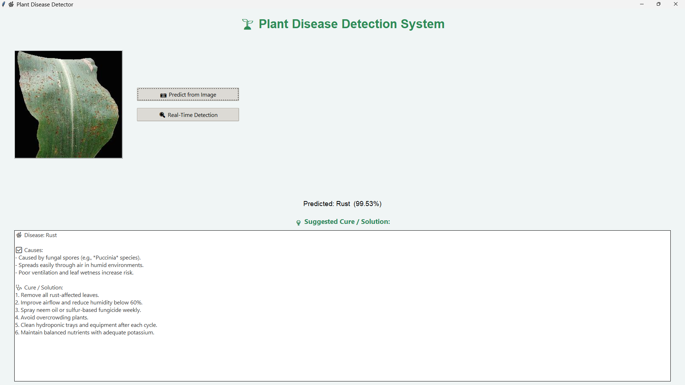
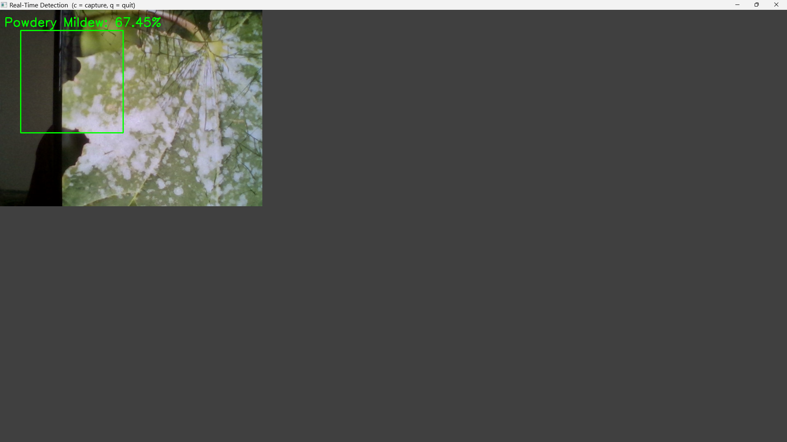

#  Plant Disease Detection with GUI + Telegram Alerts

An AI-powered desktop application that detects plant leaf diseases from either uploaded images or real-time webcam feed using a custom-trained **VGG16 Convolutional Neural Network (CNN)** model.  
It provides a detailed diagnosis, including the **disease name, confidence level**, and a **suggested cure/solution**, all displayed in an intuitive **Tkinter-based GUI**.  
The application also sends **instant Telegram alerts** containing the predicted disease along with the image.

---

##  How It Works

This model supports **two modes of disease detection**:

- Real-time Detection: Using a webcam or external camera (e.g., phone camera via Wi-Fi)
- Image Upload Detection: Upload any leaf image for prediction

> In image upload mode, the system provides the **disease prediction**, **confidence score**, and also reads a **text file containing the cause and solution** from the `solutions/` folder.  
> For real-time detection, it can use either your laptop webcam or a **phone camera over Wi-Fi** (IP Webcam supported) for remote analysis.

---

##  Features

-  Detect plant diseases from images or webcam feed
-  Built on a pre-trained **VGG16 deep learning model**
-  Sends automatic **Telegram alerts** (with message + photo)
-  Displays **predicted disease**, **confidence**, and **recommended cure**
-  Simple and elegant **Tkinter GUI**
-  Works with **Python 3.6 – 3.10**

---

## 🖼️ GUI Preview

| 📤 Upload Image | 🎥 Real-time Detection |
|----------------|------------------------|
|  |  |

---

##  Installation & Setup

### 1. Clone the Repository

```bash
git clone https://github.com/your-username/plant-disease-detector.git
cd plant-disease-detector
```
### 2. Install Required Libraries
```bash
Use the VS Code terminal or command line
pip install opencv-python==4.8.0.76 numpy==1.24.4 pillow requests tensorflow telepot
python tr.py
```
---
Telegram Notification Setup
Get instant alerts with predictions via Telegram (message + photo).

 Steps:
Go to @BotFather on Telegram and create a new bot.
Copy the BOT_TOKEN provided.

Get your CHAT_ID by sending a message to your bot, then visit:
https://api.telegram.org/bot<YourBOTToken>/getUpdates

Replace the values in tr.py:
BOT_TOKEN = "your-bot-token"
CHAT_ID   = "your-chat-id"

##  Need the Full Project Report?

If you need the **complete project package** including:
-  Final Report / Synopsis
-  Experiment Observations
-  Accuracy Graphs / Confusion Matrix
-  PPT / Documentation

Feel free to **contact me directly**. I’ll be happy to help!

Contact 📧 preetham159@gmail.com 📧 preethamn2004@gmail.com
---
